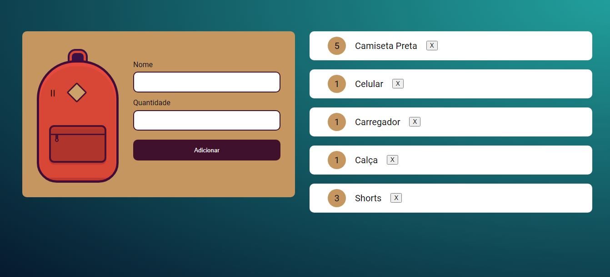

<h1 align="center"> Mochila de Viagem </h1>

  <a href="#-tecnologias">Tecnologias</a>&nbsp;&nbsp;&nbsp;|&nbsp;&nbsp;&nbsp;
  <a href="#-projeto">Projeto</a>&nbsp;&nbsp;&nbsp;&nbsp;&nbsp;&nbsp;

  

## 🚀 Tecnologias

Esse projeto foi desenvolvido com as seguintes tecnologias:

- HTML e CSS
- JavaScript
- Git e Github

## 💻 Projeto

Muitas vezes ao viajar acabamos arrumando as coisas e esquecendo de colocar algo.

Com a mochila de viagem, você pode criar uma lista com objetos essenciais para sua viagem e até removê-los quando não forem mais necessários.

- [Acesse o projeto finalizado, online](https://mochila-de-viagem-ashy.vercel.app/)
